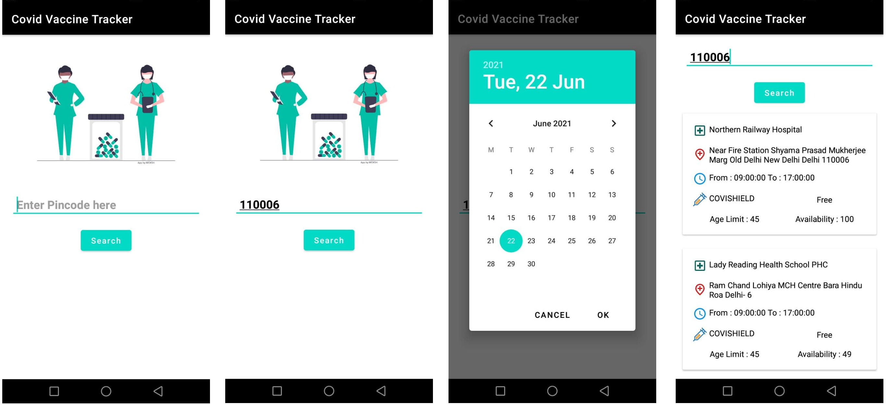

# CovidVaccineTracker
An Android app to search availability of vaccines around nearby centers. </img>
## My Learnings (How to?)
- Communicate with APIs 
- Handle Network Requests
- Use Data class in Kotlin 
- Add App Icon 
## Screenshots 

